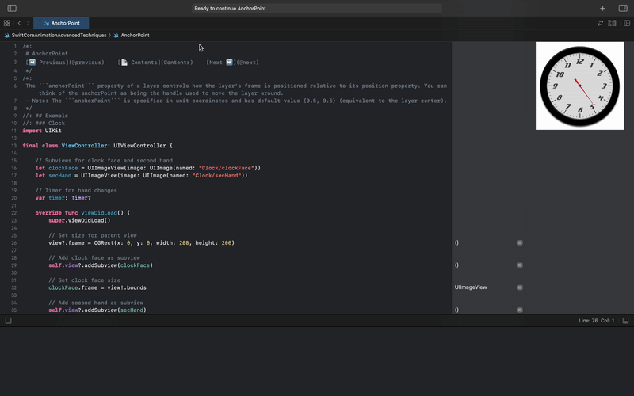

# Swift Core Animation Advanced Techniques

It is set of notes and examples of usage Core Animation in Swift based on "iOS Core Animation: Advanced Techniques" book.

## 🤔 How to use?

- 📄 Open a page
- 👩‍🏫 Read notes
- 🚀 Run and experiment with existed code
- ⏩ Go to next page


## 🛠 How to run?

- ✂️ Clone repo

  ```
  git clone https://github.com/DanilaG/swift_core_animation_advanced_techniques
  ```

- 📖 Open "_**SwiftCoreAnimationAdvancedTechniques.playground**_"
- ⚙️ Turn on "_**Show Rendered Markup**_" ("Editor" -> "Show Rendered Markup") 



## 📚 Sources
- [iOS Core Animation: Advanced Techniques by Nick Lockwood](https://www.oreilly.com/library/view/ios-core-animation/9780133440744/)
- [Apple Core Animation Programming Guide](https://developer.apple.com/library/archive/documentation/Cocoa/Conceptual/CoreAnimation_guide/Introduction/Introduction.html)
